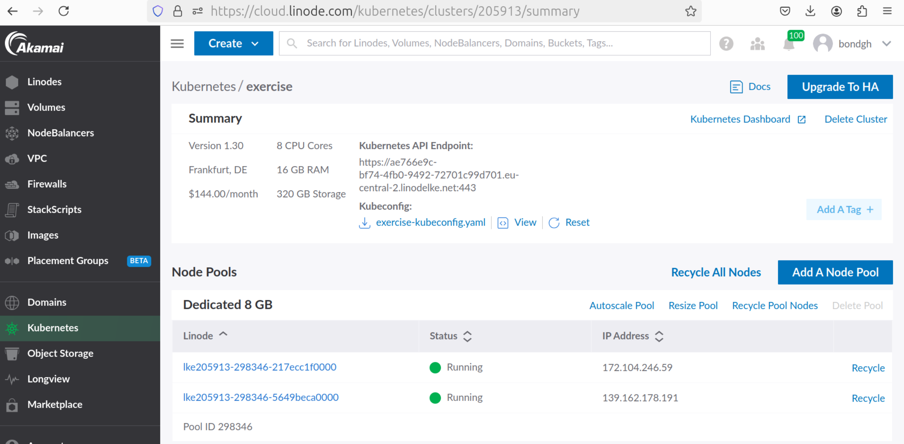
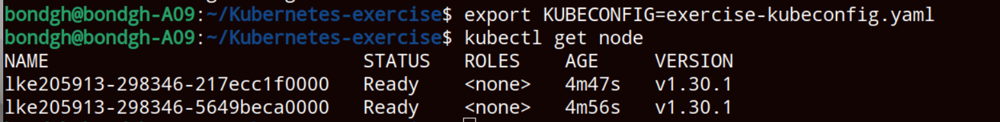
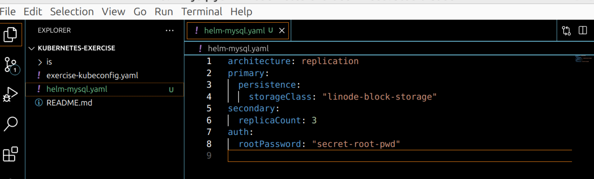
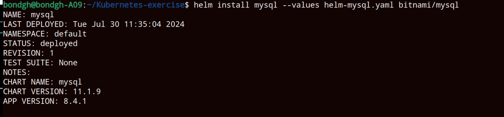
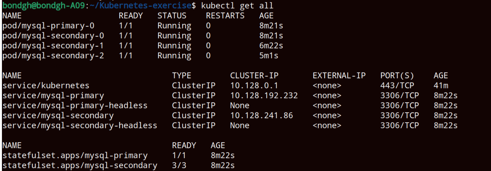
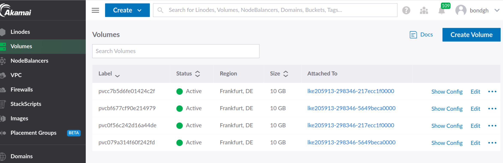

<h1>Kubernetes exercise</h1>
<h2>Technologies used</h2>

- <b>Kubernetes</b> 
- <b>Helm</b>
- <b>Helmfile</b>
- <b>Linode</b>
- <b>Java</b>
- <b>Ingress</b>
- <b>Mysql</b>
- <b>Phpmyadmin</b>

<h2>Detailed Description of Project </h2>
1. Create a Kubernetes cluster (LKE) 
2. Deploy Mysql database with 2 replicas and volumes for data persistence 
3. Deploy the Java application with 2 replicas 
4. Deploy phpmyadmin to access Mysql UI 
5. Deploy Ingress Controller in the cluster - using Helm 
6. Create an Ingress rule for your application’s access 
7. Configure port-forwarding for phpmyadmin 
8. Create Helm Chart for Java App  

   

   <h2>step1    Create a Kubernetes cluster (LKE)</h2>

   Kubernetes cluster created in linode 
   

   
   change the permissions of the kubeconfig file and export it as environmental variable 
   

   <h2>step2  Deploy Mysql database with 3 secondary replicas and volumes for data persistence</h2>
  
   Search for mysql helm chart 
   add the repository that contains the helm chart 
   Create a values configuration file to override certain default values of the helm chart 
   set architecture to replication 
   set to create persistence volume with linode block storage 
   set auth root password 
   helm-mysql.yaml 
   

   Install the chart by passing the values file to override certain values 
   

   mysql pod started with the set number of replicas in the values file "helm-mysql.yaml" 
   mysql service and pods are all successfully created 
   

   persistence volume is created for all the pod replicas as specified in the values configuration file 
   
   
  

   

   <h2>step3   Deploy the Java application with 2 replicas</h2>
 
   
   

 <h2>step4</h2>
 
     

